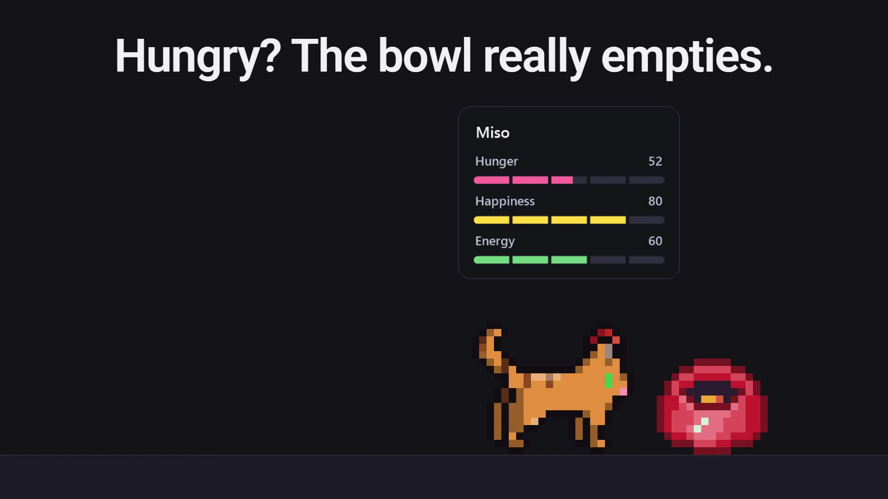
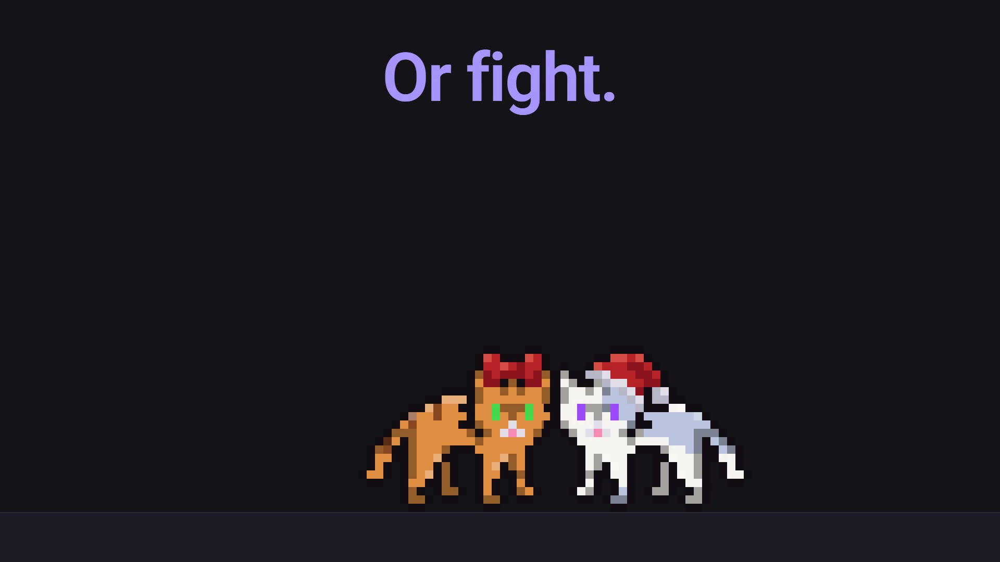
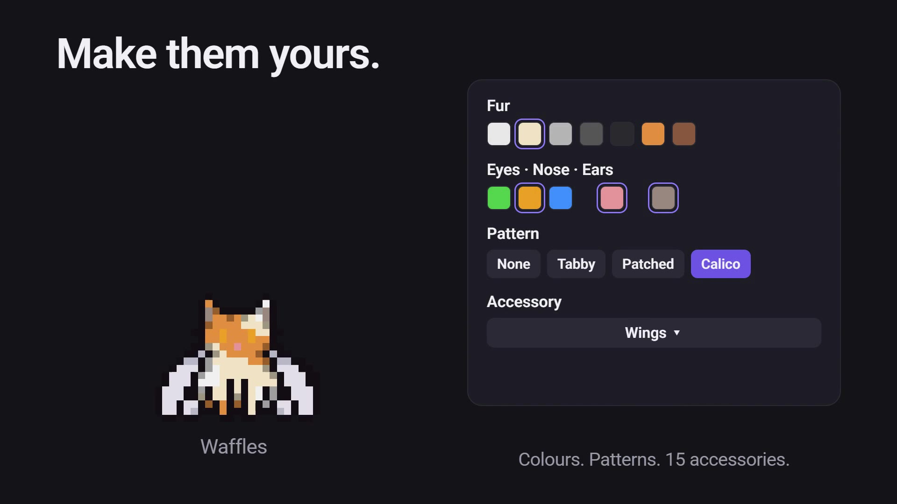

# Tam-a-Pet

Tamagotchi-style virtual pets that live on your Windows desktop. It starts with cats: they walk, sleep, play with a ball, eat from a bowl, get stroked, and groom or fight each other. More kinds of pets are planned. It is a native program (.NET 8, WinForms) built to be as light as possible: at rest it uses a few MB of memory and almost no CPU.

<p align="center"><a href="docs/tour.mp4"></a></p>

<p align="center"><sub>Click the preview to watch the 25 s feature tour with sound (cats made up for the video: Miso, Pepper, Waffles and Juno).</sub></p>

<p align="center">
  
  
  
</p>

> **Status: 0.1.0 (pre-release).** Work in progress: more features and bug fixes are coming before the first real release.

## Download

From the [Releases](../../releases/latest) page:

| File | What it is |
|---|---|
| **TamAPet-Setup.exe** | Installer: installs for your user (no administrator rights), creates the Start menu entry, the desktop shortcut (optional), start with Windows (optional) and the uninstaller in *Installed apps*. |
| **TamAPet-Portable.exe** | Portable version: a single file, runs from anywhere, installs nothing. |

Both already include everything (even .NET): nothing else to install. Requirements: Windows 10/11, 64-bit.

> Windows SmartScreen may warn that the app is "not recognised", because the executable is not digitally signed: *More info → Run anyway*. SHA-256 checksums are in `SHA256SUMS.txt` in the release.

## What it does

- **Multiple cats** (up to 8 at once), each with its own name, character (balanced, playful, lazy, greedy, chatty, attention-seeking), fur and eye colours, patterns (tabby, patched, calico) and stats: hunger, happiness, energy.
- **Multiple monitors**: each pet can live on one monitor of your choice, or roam freely between all of them; its objects stay with it.
- **Objects**: bowl, bed and ball, each with its own colour; the cats use them when they need to. They can be shared between all the cats.
- **Interactions**: click and stroke (hold and move slowly), a fast mouse near the cat makes it jump, too many clicks make it angry. Between themselves the cats groom or fight.
- **Real sounds** (meows, purring, chewing, ball) with a mixer: master volume, per cat and per kind of sound.
- **Settings** from the notification-area icon: always on top, start with Windows, language (English, Italian, French, Spanish), updates.
- **Updates**: at start it quietly checks GitHub for a newer version and tells you; it downloads and installs **only when you press the button** in *Settings → General → About*. The automatic check can be turned off.

The language of the app can be changed in *Settings → General → Language*.

Your data (settings, stats, object positions) lives in `%APPDATA%\Tam-a-Pet\settings.ini`.

## Made with AI

Tam-a-Pet is built with the help of AI ([Claude](https://claude.ai) by Anthropic).

## Build from source

You need the [.NET 8 SDK](https://dotnet.microsoft.com/download/dotnet/8.0).

```powershell
cd native
dotnet build -c Release          # to try it: native\bin\Release\net8.0-windows\TamAPet.exe
```

To make a release: raise `<Version>` (and `<InformationalVersion>`) in `native/TamAPet.csproj`, then create and push the tag (`git tag v0.1.0 && git push origin v0.1.0`): the `.github/workflows/release.yml` workflow builds and publishes the release with installer, portable version and checksums.

Versions look like `MAJOR.MINOR.PATCH` plus an optional letter:

| Part | Meaning |
|---|---|
| MAJOR | the complete release (0 = still being built) |
| MINOR | a major feature was added |
| PATCH | minor features and bug fixes |
| letter (a–z) | tiny bug fixes only, no new feature (`0.1.0` → `0.1.0a` → `0.1.0b` → `0.1.1`) |

The installer is the app itself: an executable named `TamAPet-Setup*.exe` shows the install wizard (see `native/Installer.cs`); the installed app removes itself with `--uninstall`.

## Credits

Sounds from [OpenGameArt.org](https://opengameart.org) (CC0): see [CREDITS.md](CREDITS.md). Code licence: [MIT](LICENSE).
